# my-pay

마이 페이는 무슨 일을 할까?
마이 페이 - 간편 결제 시스템 like 카카X 페이, 사과 페이 등...

비즈니스 능력을 기준으로, 고객 입장에서의 서비스(Micro Service X) 에서 마이 페이에 필요한 기능을 정의

- 회원 가입 및 정보 변경 기능
  - Membership Service! 이미 식별 완료!
- [회원 to 회원] [회원 to 일반 은행계좌] 간 간편 송금 기능
  - 일단 머니의 개념부터!!
- 가맹점에서의 결제 기능 + 가맹점 정산 기능

## 머니의 이해1 - 선불 충전 금액
James :   우리 와이프는 나에게 매월 20만원을 마이페이로 용돈을 주지! -> "**마이 머니**" 정의 해요
사용자가 마이 페이에 송금을 하면 "마이 페이 법인 계좌"에 송금이 된다. 그리고 나서 사용자 계좌에서 돈이 빠지고 
"마이 페이" SQL에 저장되어 마이 페이에 돈이 있다는것을  표현할 수 있다.
## 머니의 이해 2 - 펌뱅킹 !?
항상 10,000원씩 충전되던 이유
결제 시 10,000원 넘으면, 정확한 금액으로 충전되는 이유
송금 메뉴에 가면, 각 서비스마다 이체 가능한 은행 목록이 다른 이유
#### 펌뱅킹!
은행의 기능을 시스템적으로 이용하기 위한 수단이 시스템을 사용하는 회사 입장에서는 

개별적인 은행마다 별도의 계약을 맺고 수수료 지불

펌뱅킹 기능 사용마다 은행에 수수료를 지불해야만 해요.
- 은행 거래 즉 계좌 간 돈의 이동을 의미
- 입/출금 이행 요청 마다 고정금액 수수료 지불

## 송금시 어떤 일들이 일어날까? -> 돈을 보내는일

- [회원 to 회원]
  - 단순 선불 충전 금액(머니)의 이동 트랜잭션
    - 잔액 부족 시, 최소 10,000원 단위로 충전 후 이동

- [회원 to 일반 은행 계좌] 간 간편 송금 기능
  - 선불 충전 금액(머니)에서 타행의 실제 계좌로의 금액 이동
    - 마이 페이 법인 계좌의 이해가 필요해요.

### 마이 페이가 하는 일을 비즈니스 능력 기준으로 정의해 보자
비즈니스 능력을 기준으로, 고객 입장에서의 서비스(Micro Service X)에서 마이 페이에 필요한 기능을 정의

- 회원 가입 및 정보 변경 기능
  - Membership Service + [계좌 연결] 기능

- [회원 to 회원] / [회원 to 일반 은행 계좌] 간 간편 송금 기능
  - 회원 간 잔액 이동 비즈니스 로직
  - 외부 실제 은행 관리 시스템(모듈) - 뱅킹

- 가맹점에서의 결제 기능 + 정산 기능
  - 가맹점 관리 시스템 + 가맹점 계좌 등록
  - 결제 시스템 + 크론잡을 통한 정산 기능

--> 모놀리식 형태로 먼저 설계해보자
## 모놀리스 아키텍처에서의 멀티 모듈 마이 페이
- **회원 관리 시스템 (Membership)**
- **외부 은행 관리 - 펌뱅킹 시스템(Baking)**
- **머니 관리 시스템 (Money)**
- **가맹점 관리 시스템 (Franchise)**
- **결제 및 전표 생성 시스템 (Payment)**

**송금 ?**
- **단순 비즈니스 로직**
**정산 ?**
- **단순 Cron Job**

### 모놀리스 아키텍처에서의 멀티 모듈 마이 페이

SQL <-- Money, Franchise, Payment, Banking --> Real Bank
                                   ,Membership

## 결론
**앞으로의 계획**
간편 결제 시스템이 무엇인지 이해했어요.
Monolithic (One DB) 기준으로, 논리적인 아키텍처도 설계해 보았어요.

이렇게 설계해본 아키텍처를 MSA로 가기 위한 첫 단계인 분리/분해 부터 해보기 전에
분리 / 분해를 어떻게 하면 좋을지에 대한 이론 (비즈니스 능력 기반 / 하위 도메인 기반) 학습
분리 / 분해의 과정에서 기존의 모놀리식과 동시에 운영을 하기 위한 방안의 이론적 학습

하위 도메인 기반 분리 / 분해를 통한 MSA 마이 페이의 서비스 정의!

## 분해 = 비즈니스 능력(Business Capability)을 기준으로 서비스를 정의 하는일
왜 분해 / 통합이 어려울까?
MSA에서 분리 / 분해의 의미는
**"Business Capability를 가질수 있는 방향으로 서비스를 정의 하는 일"** -> 통합이 될 수도!

수 많은 복잡한 비즈니스가 있는 시스템에서 각 서비스가 Business Capbility를 
최대한 가질 수 있도록 적절하게 서비스를 정의하는 일

각 서비스별로 하나의 DB를(MSA) 가진다는 관점에서, 각 서비스 간 적절한 관계를 통해 Business Capability 확보하는 것이 관건!

**어떤 기준에 따라서? 어떤 지침에 따라서? 분리/분해/통합 하면 좋을지가 Business Capability를 가질 수 있을까??**
**--> 비즈니스 동작 / 하위 도메인 패턴이 그 수단이 되어 줄 수 있어요.** 
 하위 도메인(Sub-Domain) --> 도메인 주도 설계(Domain-Driven Design, DDD)에서 나온 개념!

주문 
- 주문 서비스 (고객 입장)
- 주문 접수
  - 주문을 "잘" 접수하는 것에 집중
    - 비동기 통신 파턴(큐잉) 등의 스택에 집중
- 주문 결제
  - 받은 주문에 대한 결제를 "잘"하는 것에 집중
    - 외부 결제 모듈의 통신 or 낮은 수수료를 위한 방안 찾는 데 집중
- 주문 단계에서의 추천
  - 주문 과정에서 "적절한" 방식으로 추가 상품 구매를 유도 집중 
    - AI/머신 러닝 활용으로 고객 별 최적화에 집중

# 도메인 주도 설계(DDD)
## 유비쿼터스 언어
복잡한 도메인을 이해하고 해결하기 위한 팀(해결을 위해 모인 집단)이 공통으로 쓰기 위한 언어들의 약속
개발자와 비개발자가 문제(도메인)을 해결하기 위해 사용할 언어들의 의미에 대한 약속 모음!
## 도메인 모델
유비쿼터스 언어를 사용하여, 비즈니스 요구사항을 만족하기 위해서 표현하기 위해
도메인들의 핵심 개념과 규칙을 표현하는 **객체들의 관계**로 구성됨
ex) 주문 서비스, 음식 관리 서비스, 배달 서비스
비즈니스 = 비즈니스 동작(해결해야할 문제)들의 모음
도메인 = 그리고 이 문제들을 핵심 개념과 규칙(객체 형식)으로 표현하는 것
도메인 모델 = 이런 객체들 간의 관계까지 표현한 것

하지만, 그저 이렇게 도메인을 식별하기만 해서는 도메인 모델을 그리는 의미와 목적이 부족할 수 있음
** 목적 - 도메인들의 핵심 개념과 규칙을 표현하여 적절하게 분ㄹ리할 수 있도록 돕는 것
그래서, 아래와 같은 개념들이 있고 이러한 개념들은 도메인 간의 핵심 개념과 규칙을 이해하는 데 도움을 줌

**엔티티(Entity): 하나의 객체를 의미하며, 하나의 테이블 모델로서 존재할 수 있는 데이터들의 묶음**
**어그리거트(Aggregat): 데이터 변경의 단위로 다루는 연관된 엔티티들의 묶음 (관련된 객체들의 집합)**
**어그리거트 루트(Aggregate Root): 어그리거트(집합)에서 도메인의 중심을 의미하는 엔티티를 의미**
## Bounded Context
- 정의한 여러 도메인(모델, 문제영역)들을 기준으로, 각 도메인 모델들의 관계 표현 시
    각 모델들은 상호 배타적인 무제를 해결해야만 한다는 DDD의 핵심원칙!
- **주문 서비스 - 고객 입장**
  - 특정 음식점의 음식들을 주문할 수 있다.
    - **주문 접수**
      - 주문을 "잘" 접수하는 것에 집중
        - 비동기 통신 패턴(큐잉) 등의 스택에 집중
    - **주문 결제**
      - 받은 주문에 대한 결제를 "잘"하는 것에 집중
        - 외부 결제 모듈의 통신 or 낮은 수수료를 위한 방안 찾는데 집중
    - **주문 단계에서의 추천**
      - 주문 과정에서 "적절한" 방식으로 추가 상품 구매를 유도 집중
        - AI/머신 러닝 활용으로 고객 별 최적화에 집중
하위 도메인들은 상호 배타적인 문제를 가지고 있어야한다가 Bounded Context의 핵심원칙

## 하위 도메인
정의한 도메인 모델들을 Bounded-Context 원칙에 따라,
    Business Capability 를 높일 수 있는 방식으로 분리해야 한다는 원칙
즉, 분명한 Bounded-Context를 가지는 어그리거트 간의 관계와
    각 어그리거트 별로 어그리거트 루트로 분리된 어그리거트는 하위 도메인이다.

**Bunded-Context를 가질 수 있는 하위 도메인들을 각 서비스로 식별할 수 있다는 개념(패턴)이 "하위 도메인 패턴에 의한 서비스 식별!"**

## 분리 지침, 가이드
"하위 도메인"패턴은 Bounded Context에 따라 도메인을 분리해야 한다는 원칙.
그렇다면, Bounded Context 만 만족한다면 무조건 부리해도 되나요? 어디까지 분리해야 하나요?

추가적으로 2가지 원치이 "분리 지침"이 되어줄 수 있음. (from, Uncle Bob, 로버트 C. 마틴 (Robert cecil Martin))

**단일 책임 원칙(SRP, Single Responsibility Principle)**
- "클래스는 오직 하나의 변경 사유를 가져야 한다."
**공동 폐쇄 원칙 (CCP, Common Closure Principle)**
- "패키지의 클래스들은 동일한 유형의 변경에 대해 닫혀 있어야 한다. 패키지에 영향을 주는 변경은 그 패키지에 속한 모든 클래스에 영향을 끼친다."
- 동일한 사유로 변경되는 클래스들은 동일 패키지에! "주문 결제"시 항상 결제 이력 업데이트
  - 결제 이력 패키지는 "주문 결제"와 동일한 패키지에

## 모노리스 환경에서 MSA로 분해 과정에서의 장애물
### 네트워크 지연(Network Latency)
Case Monolithic. 배달 주문 앱을 통해, 고객이 카드 결제가 포함된 주문 접수를 요청한다면?
요청부터 응답까지 걸리는 시간에 포함되는 것은?
1. 모바일 클라이언트 -> 주문 접수 모듈
2. 주문 접수 모듈/결제 모듈에서의 비즈니스 로직 + [[DB Access]]
3. 결제 모듈에서 카드사로 통신 (e.g. HTTP Call)
4. 카드사 로부터의 Response 후, 추가 비즈니스 로직 + [[DB Access]]
5. 모바일 클라이언트 리턴
Case MSA. 배달 주문 앱을 통해, 고객이 카드 결제가 포함된 주문 접수를 요청한다면?
요청부터 응답까지 걸리는 시간에 포함되는 것은?
1. 모바일 클라이언트 -> 주문 접소 서비스
2. 주문 접수 서비스에서의 비즈니스 로직 + [[DB Access]]
3. **주문 접수 서비스 -> 결제 서비스 통신 (e.g. HTTP Call)**
4. 결제 서비스에서의 비즈니스 로직 + [[DB Access]]
5. **결제 서비스에서 카드사로 통신 (e.g. HTTP Call)**
6. 카드사 로 부터의 Response 후, 결제 서비스에서 추가 비즈니스 로직 + [[DB Access]]
7. 결제 서비스 로부터의 Response 후, 주문 접수 서비스에서 추가 비즈니스 로직 + [[DB Access]]
8. 모바일 클라이언트로 응답

네트워크 Call이 MSA에서 더 많이 하게 된다. 그래서 모노리스보다 네트워크 지연이 될 확률이 높을 수 있다.
모노리스에서 발생하지 않았을 문제가 MSA에서는 일어날 수도 있다.
네트워크 지연이 생김에도 불구하고 힘들더라도 모니터링 시스템을 더 높이던가 해서 극복을 해야한다.
### 트랜잭션
Case Monolithic. 배달 주문 앱을 통해, 고객이 카 드 결제가 포함된 주문 접수를 요청한다면?
요청부터 응답까지 걸리는 시간에 포함되는 것은?
1. 모바일 클라이언트 -> 주문 접수 모듈
2. 주문 접수 모듈/ 결제 모듈에서의 비즈니스 로직 + [[DB Access]]
3. 결제 모듈에서 카드사로 통신 (e.g. HTTP Call)
   1. 카드사 로부터의 Response 후, 추가 비즈니스 로직 + [[DB Access]]
   2. (실패 시) 실패에 대한 비즈니스 로직 + [[DB Access]]
4. 모바일 클라이언트 리턴

### 가용성
요청에 대해서, "해야하는 일"이 얼마나 오랜 시간 운영이 가능한지를 나타내는 정도
Case MSA. 배달 주문 앱을 통해 고객이 카드 결제가 포함된 주문 접수를 요청한다면?
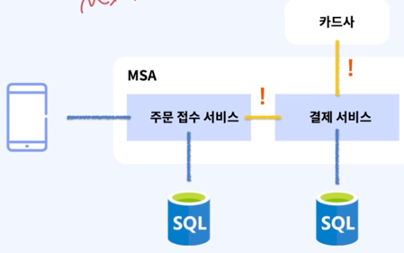

외부의 경우 불가피 하지만, 내부 통신 구간에서 문제가 생긴다면..
1. 내부 모듈을 통해 **호출 가능했을 수** 있던 Call에 문제 가능성 UP
--> 분해로 인해 필연적으로 가용성 Down!

**"요청이 다음 스텝(모듈/서비스)으로 얼마나 잘 갈 수 있을지!?"**
--> 비동기 통신이 하나의 해결 방법이 될 수도!
--> 가용성 문제 해결을 위해 "서킷 브레이커" 적용도 가능

## 분해만 하면 끝인가요?
(분해 과정에서 버시스 운영_스트랭글러 패턴과 통합 글루)
### 분해가 어려운 건 알았어요. 그러면 전환은 어떻게 하나요?
전환을 비롯해 새롭게 구축하는 상황에서조차, "분해"가 어렵다는 것은 알았어요.
안그래도 어려운 분해를, 기존 운영중인 모놀리식에서 전환은 어떻게 하면 좋을까요?

**모놀리식에서 MSA로 전환을 위해 고려해야할 것들을 해결해야겠죠? 마이그레잉션의 영역**
모놀리식과 MSA의 큰 차이점을 위해 한번에 개발 후 빅뱅?
"완전히 뜯어 고치는 것"이 보장 하는 것은 "전부 다 뜯어 고친다"는 사실 뿐 - 마틴 파울러 (Martin Fowler)

서비스 단위로, 하나씩 하나씩 분해하며 소프트하게 전환하는 방법을 알아보자!!

### 스트랭글러 (Strangler) - 덩굴 패턴?
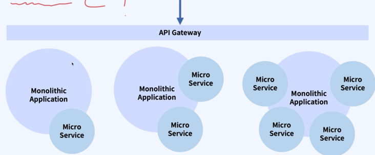
Monolothic DB를 Micro Service DB로 마이그레이션이 목적
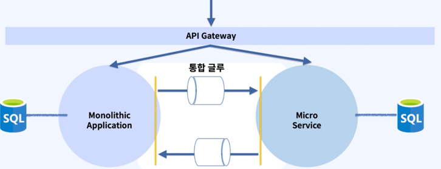
운영하고 있는 환경에서 MSA 환경으로 변환하기 위해서 필요한 통합 글루가 필요하다.
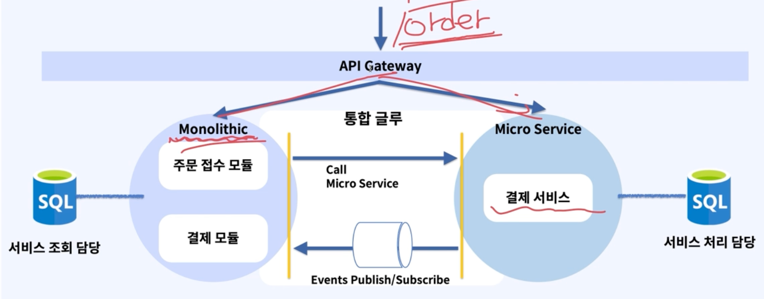
마이크로 서비스에서 처리된 데이터를 Event로 처리해서 모놀리스 환경으로 통신해서 처리한다.
그래서 이렇게 하나씩 마이크로 서비스로 변경해서 처리한다.

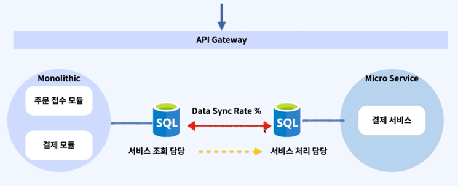
기존에 있던 모노리스에 있던 서비스 조회 담당을 없앨 수 있는 조건은 결제 서비스에서 모든 처리를 서비스 처리 담당 DB로 하게 되면 된다.\

### 결론 
전환을 비롯해 새롭게 구축하는 상황에서 조차, 물리적인 한계로 "분해"가 어렵다는 것은 알았다.

그리고 이런 한계들을, 다양한 패턴들을 통해 극복 가능하다는 것도 알았다.
물론 잊지 말아야할 것은, 이 ㅐㅍ턴들을 구현하는 것도 모두 시간과 비용이 필요하다는 점이다.
**- 한계: 네트워크 지연, 트랜잭션, 가용성**

이렇게 극복한 패턴들을 이용해서, 기존에 운영중인 Monolithic으로부터 MSA로 전환하는 방법도 알아 봤다.

앞으로의 계획

기술의 목적과 한계들에 대해 항상 생각하면서..

"마이 페이" 라는 시스템이 하는 일이 무엇인지를 생각하면서, MSA 아키텍처를 구성해 보고
기존에 설계해 보았던 마이 페이 Monolithic 아키텍처와는 어떻게 달라질 수 있을지 살펴볼 예정!

## 마이 페이의 시스템 작업과 서비스 식별하기
### MSA 아키텍처를 위한 Micro Service를 식별하기 위해서...

#### 1단계
기능 요건 정의하기 (**from 도메인 전문가**)
  - 기능 요건이란, 시스템이 갖춰야 할 요건을 정의하는 것
  - 도메인 레벨에서, 해당 시스템은 어떤 것을 해야한다에 대한 요건들
### 2단계
기능 요건 으로 부터 사용자(액터) 시나리오, 케이스 정의하고 **도메인 모델** 도출
### 3단계
2단계에서 도출한 시나리오를 만족하기 위해, 마이 페이라는 시스템이 해야할 작업 식별하기
### 4단계
식별된 작업을 기준으로, "도메인" 즉 "서비스"를 정의하기. (비즈니스 능력별 기준 or/and 하위 도메인별-(sub domain) 분해)

하지만, 절대적인 것은 없다! 그래서 MSA 컨설팅을 받기도 한다.

#### 기능 요건 정의해보기
시스템이 갖춰야 할 요건을 정의하는 것.
시스템에 참여하는 주체가 (Who) --> 고객으로서 / 마이페이 직원으로서 / 가맹점주로서
어떤 수단을 통해서(Through) --> 외부 은행과 통신, 주기적인 정산 작업을 진행, 파라미터 변경(이벤트 관리, 수수료율 조정, ...) ....
무엇을 이루고자 하는지(What) --> 머니충전: 선불 충전 금액의 관리 | 송금: 내가 소지한 돈의 이동 | 가맹점 정산, 결제, 회계 시스템 연계,,,,

#### 도메인 모델 도출해보기
기능요건으로부터, 도메인 모델 (관리가 필요한 정보들)을 도출해 보는 작업
고객으로서 / 마이페이 직원으로서 / 가맹점 주로서 --> 법인 계좌 관리, 직원 관리, 인증 도메인 | 고객(개인/가맹점), 인증 도메인 | 외부 은행 관리, 펌뱅킹 수수료 관리, 계약 등 관리 (은행)  | 정산 주기, 정산 조건, 수수료 등 관리 (정산)
뱅킹, 정산, 파라미터 변경(이벤트, 수수료율 조정, ...) ... --> 수수료를 포함한 비즈니스 정보관리 (결제, 정산 등 정보 관리) | 이벤트/캠페인 관리 | 충전, 송금, 정산, 결제 정보 관리
머니 충전, 송금, 정산, 결제, 회계 시스템 연계, ... --> 회계 시스템 연계 관리 | 감사 관련 정보 관리(AML/STR/CTR, ...)

#### 고수준(사용자 입장) 시나리오, 케이스 정의하기 1 - 송금
**전제**
- 계좌 등록이 완료된 정산 상태의 고객(회원)이 있다.
- 마이페이와 연계된 은행이 있다.
- 마이페이 회원 뿐만 아니라, 외부 은행 계좌로도 송금이 가능하다.
- 송금 수수료가 존재한다.
- 마이페이 법인 계좌에는 추분한 금액이 존재한다.
**조건(when - 행동)**
- 고객의 마이머니와 연계된 계좌의 잔액은 송금하고자 하는 금액과 수수료의 합보다 많다.
- 외부 은행 계좌는 모두 펌뱅킹 계약 및 시스템 연계가 되어 있다.
- 고객은 타 고객 또는 외부 은행 계좌에 송금 요청을 한다.
**결과**
- 타 고객의 마이머니가 송금하고자 했던 금액만큼 충전된다.
- 외부 은행 계좌로부터 정산 송금처리 응답을 받는다.

#### 고수준(사용자 입장) 시나리오, 케이스 정의하기 2 - 정산
**전제**
- 계좌 등록이 완료된 정상 상태의 고객(회원)이 있다.
- 계좌 등록이 완료된 가맹점주(회원)가 있다.
- 정상 처리 된, 결제 전표가 1개 이상 존재한다.
- 결제 수수료가 존재한다.
- 마이페이 법인 계좌에는 충분한 금액이 존재한다.
**조건(When - 행동)**
- 주기적으로 정산을 위한 작업이 실행된다.
- 정상 처리 된 전표를 계산하여, 정산 완료된 금액에서, 결제 수수료만큼 제한 금액이 마이페이로부터 가맹점주 계좌로 송금 요청한다.
**결과**
- 1개 이상의 정산 처리 된 결제 건들의 전표 금액의 총합 만큼 사전 등록된 가맹점주의 계좌로 이체된다.

### 시스템 작업 정의하기
마이페이 라는 시스템이 해야할 일을 정의하기
- 회원 가입해 줘, 가맹점 등록해 줘
- 마이머니 20,000원을 충전해줘
- Daniel(or ABC은행 112-34)에게 송금해줘
- NoNo 치킨에서 30,000원을 결제해 줘
- 정산을 통해 완료된 결제 건들을 처리해 줘
- 결제 수수료를 변경해 줘

### 시스템 커맨드 정의하기
정의된 시스템 작업들을 기준으로, 주체와 커맨드(도메인 모델 데이터의 변경) 작업 정의하기 
- 회원 가입해 줘, 가맹점 등록해 줘 -----> (고객 가맹점) createMembership
- 마이머니 20,000원을 충전해줘 -----> (고객) rechargeMyMoney
- Daniel(or ABC은행 112-34)에게 송금해줘 -----> (고객) remittanceMoney 
- NoNo 치킨에서 30,000원을 결제해 줘 -----> (고객) payWithMyMoney
- 정산을 통해 완료된 결제 건들을 처리해 줘 -----> (직원) settlement
- 결제 수수료를 변경해 줘 -----> (직원) modifyCommission

#### 결국, 시스템이 무슨 일을 해야 하는지를 정의
(고객 가맹점) createMembership   
(고객) rechargeMyMoney
(고객) remittanceMoney
(고객) payWithMyMoney
(직원) settlement
(직원) modifyCommission

이러한 작업들을 통해 알고자 하는 것?
--> 서비스의 식별, 그리고 효과적인 아키텍처 디자인/설계
시스템이 무슨일을 해야하고 어떤 비즈니스 / 엔지니어링 특성을 가지며 이로 인해 아키텍처에 영향을 미치는지 파악

e.g.1 정산 작업의 경우, 매우 많은 결제 건들을 ㅈ안정적으로 실패 없이 처리 하기 위한 아키텍처, 기술 스택 등을 고민
--> 재시도, 큐잉, 정산 주기/금액에 대한 고민, 은행 계약상 한계 등 고민

e.g.2 외부 시스템 호출이 매우 잦다는 엔지니어링 특성, 호출 카운트 마다 수수료 과금된다는 비즈니스 특성
--> 비교적 더 자주 실패에 대한 가능성 존재
--> 성공/실패에 대한 기록과, 꼭 필요한 경우네만 재시도 판단 필요

## 마이 페이의 시스템 작업과 서비스 식별하기
### 시스템 작업 기반, "서비스" 식별하기 - 앞선 작업들의 조합
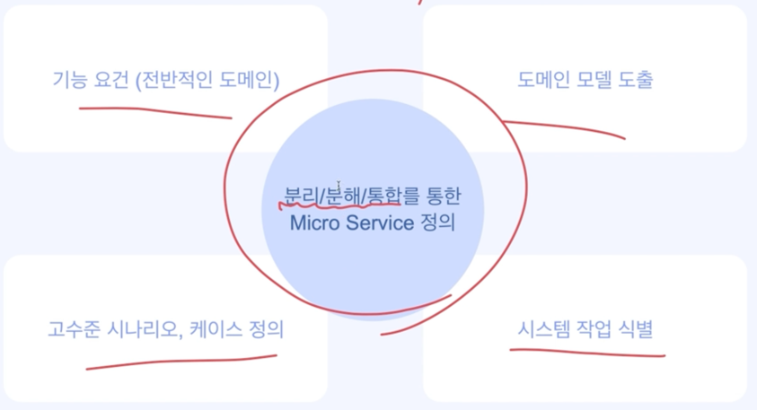

### 모놀리식 마이페이에서 분리/분해 - Based on DDD with SRP/CCP
DDD(Domain Driven Design) 기반, 분해지침에 따른 서비스 식별/분리/통합
- 하위 도메인 (Sub-Domain)
  - 어플리케이션(시스템)의 문제 공간을 가리키는 용어 (Problem Space)
    - 비즈니스, 엔지니어링 특성을 고려한 아키텍처 설계
    - 비즈니스 능력을 기준으로 분해하는 것과 유사
  - 경계 컨텍스트 (Bounded Context)
    - 마이크로 서비스 간에는 경계가 분명한 책임(Context)을 가지고 있어야 한다.
  - 단일 책임 원칙(Single Responsibility Principle), 공동 폐쇄 원칙(Common Closure Principle)
    - 분해를 위한 가이드 라인

 **비즈니스/엔지니어링 적 특성을 고려한 아키텍처 설계**
 
- 금융이라는 비즈니스 특성상, "송금", "정산" 도메인 필요하다고 판단
  - 일부 기능은 결제와 뱅킹 모듈에서 Bounded-context, Sub-domain 개념을 활용하여 분리, 송금/정산으로 통합.
- 단일 책임 원칙에 의거(Single Responsibility Principle),
  - "돈을 보낸다"라는 행동이 **응집된 하나의 비즈니스** 성격
    - "**송금**"이라는 서비스를 식별
  - "주기적인 스케쥴링 및 결제 내역들의 Integration, 후속 핸들링 책임이라는 **별도의 응집된 비즈니스**"
    - "**정산**" 이라는 서비스를 식별
- 공동 폐쇄 원칙(Common Closure Principle)에 의거,
  - 뱅킹이 가지고 있던 송금 요청 내역의 관리라는 "Class"를 송금 서비스의 책임으로 변경
    - 즉, 외부 계좌에 대한 송금 요청 내역의 관리(Class)와 **송금 서비스가 책임질 도메인**과 동일한 유형의 변경으로 간주
  - **결제**가 가지고 있던 **주기적인 정산 및 재시도 등에 대한 관리라는 "Class"** 를 정산 서비스의 책임으로 변경
    - 즉, **주기적인 정산 및 재시도 등에 대한 관리** 를 **정산 서비스가 책임질 도메인**과 동일한 유형의 변경으로 갖누
  - 프랜차이즈 라는 모듈은 회원 관리 도메인으로 통합

- 앞서 시스템이 하는 작업들을 식별하는 과정에서 알게 된 엔지니어링/ 비즈니스적인 특성을 고려한 아키텍처 설계
  - 대용량 데이터를 처리하는 "정산" (높은 cpu, container, memory)
  - 잦은 외부 인프라 호출을 위한 "뱅킹"

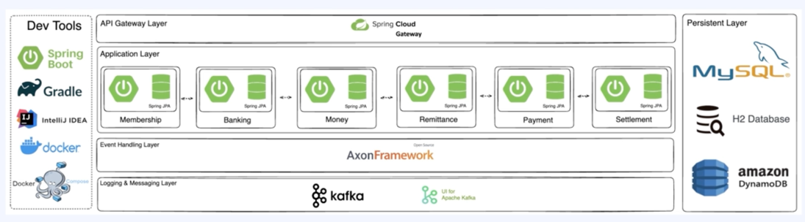

### 아키텍처를 가지는 마이 페이를 이루는 서비스
#### Membership Service(멤버십 서비스)
- 고객(회원/가맹점)을 관리하고 계좌 등록, 인증 등 마이페이의 고객을 관리하고 편의 기능을 제공하는 서비스

#### Banking Service(뱅킹 서비스)
- 외부 은행과의 직접적인 통신을 담당하고, 펌뱅킹 계약이나 수수료 관리 등 외부 은행 사용과 관련된 모든 기능을 제공하는 서비스

#### Money Service(머니 서비스)
- 고객의 선불 충전 금액(머니)을 관리하고, 이에 대해 다양한 쿼리를 제공할 수 있는 서비스

#### Remittance Service(송금 서비스)
- "송금" 이라는 비즈니스 과정 전체를 관리하고, 트랜잭션에 대한 책임을 가지는 서비스

#### Payment Service(결제 서비스)
- "결제" 이라는 비즈니스 과정 전체를 관리하고, 트랜잭션에 대한 책임을 가지는 서비스

#### Settlement Service (정산 서비스)
- 주기적으로 정산 작업을 진행하며, 여기서 생기는 모든 과정을 관리하는 서비스

### 결론
#### 기능 요건 정의
- "어떤 일을 해야 하는 시스템인지" 비즈니스 도메인의 관점에서 기술

#### 도메인 모델 도출
- 어떤 "도메인 모델"(관리해야 할 대상, CRUD가 필요한 대상) 이 존재할 수 있는지 식별

#### 고수준 시나리오, 케이스 정의
- 도메인 모델들을 사용하여, 사용자 입장에서 어떤 시나리오들을 만족시켜야 하는지

#### 시스템 작업 식별
- 도메인 모델 간의 상호 관계와, 이들이 어떤 "작업"을 해야할 지를 구체적이고 상세하게 정의

Business - 분리/분해/통합 ----> Micro Service


## Application Dockerizing
### 마이페이회원정보 변경 기능 추가, Dockerizing
- Docker는 어떤 역할을 해주는 지 학습
  - 일반적인 CI/CD 과정에서의 Dockerizing
  - 마이 페이에서의 Dockerizing

### Dockerizing
- 어플리케이션을 docker build 를 통해 image 로 만드는 작업.(Containerizing)
- 일반적으로 Dockerfile 이라는 파일에, image 를 빌드하는 일련의 작업을 정의

**장점**: 운영 체제와 하드웨어에 독립적(JVM)//환경 일관성//격리성//빠른 배포와 롤백 가능
**단점**: 러닝 커브//docker 라는 추가적인 리소스//보안 이슈//이미지 크기 최적화 어려움

- 일반적인 CI/CD 과정에서의 Dockerizing
  - 코드 푸시 -> CI(Continuous Integration) 현재 추세는 build 뿐만아니라 image 까지 만듦,, -> CD(Continuous Deployment)

## docker-compose 로 실행
### Docker-compose
- docker image들을 이용해서, 여러개의 컨테이너를 실행하고 이 컨테이너들의 관리를 위한 도구
- 여러 컨테이너로 구성된 복잡한 애플리케이션 환경을 관리해 주는 도구
- 주로 docker-compose.yml 파일에 정의를 하고, 네트워크, 볼륨 등을 정의하여 한번에 여러 컨테이너를 실행

여러 어플리케이션을 image로 만들고, 이 image 들을 Local (1 Computer) 환경에서 실행할 수 있도록 지원.

**"제한된 환경에서 MSA 환경을 구성해 보고 학습하는데 있어서 적절한 도구"**

## 뱅킹 서비스 정의 하기, 도메인 모셀 설계하기
### 뱅킹 서비스 정의
- 외부 은행과의 직접적인 통신을 담당하고, 펌뱅킹 계약이나 수수료 관리 등 외부 은행 사용과 관련되 모든 기능을 제공하는 서비스
  - A 계좌로부터 출금하여, B 계좌로 입금을 하라는 요청을 받아서, 은행망으로 펌뱅킹 명령 송신
  - 현재 계약 되어있는 은행들의 상태와 만료 기간 등을 관리
  - 모든 펌뱅킹 명령에 대해서 기록하고, 정상적으로 완료된 명령들의 수수료 계산
  - 특정 계좌가 정상 상태인지 체크하는 요청 지원

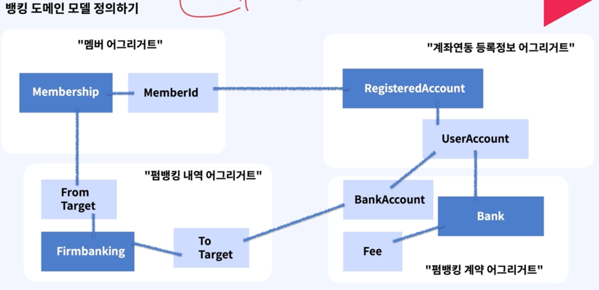
- To Target은 회원, 외부 인행계좌일 수 있다.
- From Target은 항상 회원이다.
계좌연동, 펌뱅킹

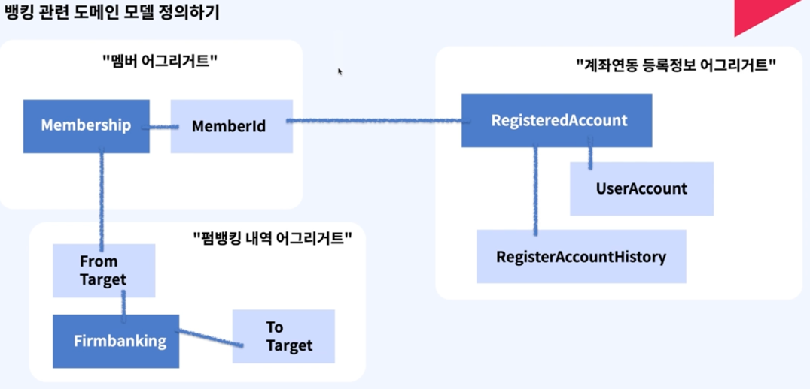
- **뱅킹을 연동하지 않고 이정도를 MVP로 계획한다.**
- 외부 은행과 입/출금 요청 펌뱅킹 통신을 담당하고, 내부 고객의 계좌 정보를 등록하는 서비스

### 뱅킹 서비스 패키지 설계, API 식별
#### 도메인 모델기반, 모델 객체 식별해보기
**"계좌 연동"**
- RegisteredBankAccount (고객의 등록된 계좌)
- RegisteredBankAccountHistory
**"펌뱅킹 관련""**
- RequestFirmbanking (받는사람, 보내는사람(은행정보), 금액, 시간)
- RequestFirmbankingHistory
- BankAccount (외부 은행 수많은 정보, 개설, 폐쇄, 세금)

#### API 설계
##### Query
- 입금/출금 요청(펌뱅킹) 내역 조회
  - find - FirmBankingInfo ( -by-membershipId)
  - Request: membershipId
  - Response: Firmbanking Object
- 고객의 연동된 계좌 (고객 계좌 연동정보) 조회
  - find - RegisteredBankAccount(-by-membershipId)
    - Request: membershipId
    - Response: RegisteredBankAccount Object
##### Command
- 고객 정보에 대해 요청된 Account 정보를 매핑, 연동
  - register-BankAccount(-with-membershipId)
    - Request: membershipId, BankAccount
    - Response: RegisteredBankAccount Object
- 실제 실물 계좌에서의 입/출금을 요청하는 펌뱅킹을 요청, 수행
  - request - Firmbanking - (-to Remittance)-(-with BankAccount)
    - Request: from Bank Account, to Bank Account, Money
    - Response: RequestFirmbankingUUID

### 뱅킹 서비스 MVP 개발2 (은행으로 입금 및 출금 요청하기)
#### Command 
- 실제 실물 계좌에서의 입/출금을 요청하는 펌뱅킁을 요청, 수행
  - request - Firmbanking - (-to Remittance) - (-with BankAccount)
    - Request: from Bank Account, to Bank Account, Money
    - Response: RequestFirmbankingUUID
#### Query
- 입금/출금 요청(펌뱅킹) 내역 조회
  - find - FirmBankingInfo - (-by-membershipId)
    - Request: membershipId
    - Response: Firmbanking Object

### 머니 서비스 정의
- 고객의 선불 충전 금액(머니)을 관리하고, 이에 대해 다양한 쿼리를 제공할 수 있는 서비스
- 특정 고객의 선불 충전금액(마이 머니)를 관리(증액, 감액)
- 고객의 마이 머니 변동 Command 관리, 정합성 유지
- 특정 고객의 마이 머니 변동 기록(입, 출금) Query 지원
- 다양한 종류의 Query 지원 (e.g. 강남구에 사는 고객들의 머니 총합을 알고싶다면??)
#### 머니 서비스 MVP 버전 정의하기
- Money Service(머니 서비스)
  - 고객의 선불 충전 금액(머니)을 관리하고, 이에 대해 다양한 쿼리를 제공할 수 있는 서비스
- Money Service MVP Version (머니 서비스, Minimal Viable Product)
  - 고객의 선불 충전 금액 마이머니의 증액/감액을 담당, 기록
#### 머니 서비스 패키지 설계, API 식별
도메인 모델기반, 모델 객체 식별해보기
**"머니 관련"**:"머니 증액(충전)/감액 관련"
- MemberMoney:IncreaseMoneyRequest(실물계좌->법인계좌로현금이동)
- LinkedBankAccount:DecreaseMoneyRequest(송금시 사용 예정)
- //엄밀히는 Bank Service의 Data:MoneyChangingResultDetail
- //Money의 입장에서 "연동 되었다" 의미 한정필요:MoneyChangingHistory
**Money Service MVP Version(머니 서비스, Minimal Viable Product)**
- 외부 은행과 입/출금 요청 펌뱅킹 통신을 담당하고, 기록하는 서비스
#### Query
- 고객의 머니 변동(입/출금, 증액/감액) 내역 조회
  - find-MoneyChaningHistory (-by-membershipId)
    - **Request**: membershipId
    - **Response**: MoneyChaningHistory Object
  - 고객의 머니 잔액 정보, 계좌 연동 정보 조회
    - find-MemberMoney (-by-membershipId)
      - **Request**: membershipId
      - **Response**: MemberMoney Object 
#### Command
- 고객의 머니 변동(충전-증액) 요청
  - request-MoneyChanging (-by-IncreaseMoneyRequest)
    - **Request**: IncreaseMoneyRequest Object
    - **Response**: MoneyChaningResultDetail Object
- 고객의 머니 변동(감액) 요청  // 이후, 송금서비스에서 사용 예정
  - register-MoneyChanging(-by-DecreaseMoneyRequest)
    - **Request**: DecreaseMoneyRequest Object
    - **Response**: MoneyChaningResultDetail Object

## 분해로 인해 달라진 것들
### 1. 모듈 간 통신 -> 서비스(프로세스) 간 통신
- Method(Function) Call
  - -> Network (http, grpc, ...)
#### 발생 가능한 문제들 1
- **요청에 대한 처리량 (throughput)이 급격히 하락**
  - 각 서비스의 정확한 필요한 컴퓨팅 리소스 파악 어려움
  - 필요한 컴퓨팅 자원의 최적화 어려움 -> 성능 하락 가능성
  - 해결점: 특정 서비스들의 비즈니스 도메인 특성을 프로그래밍과 연계하여 정확히 파악 -> 어느 서비스에서 얼마나 자원이 필요할지 파악
- 필요한 컴퓨팅 자원의 최적화 어려움 -> 성능 하락 가능성
  - Connection Pool 관리.
  - if JVM > 한정된 리소스로 JVM 최적화가 더 어려워짐
    - 의도치 않은 결과 발생 가능성
- **http, grpc 프로토콜 상의 이슈로 디버깅 어려움**
  - Conn Timeout, tcp-3handshake 이해, grpc code, ...
  - 해결점: 프로토콜 및 통신과 관련된 프로그래밍 언어 기반지식, 이러한 문제들을 실제로 경험해보고 대용량 MSA 환경에서 디버깅 경험

**"여러가지 문제를 해결해 주는 MSA 패턴으로 해결할 수 있는 영역이 아님**
### 2. 모니터링 방식의 변경
- 정형화된 로그, 메트릭 수집 방식
  - 모놀리식 환경
    - Node Exporter를 활용하여, Node(DB) 상태에 집중
  - MSA 환경
    - Node 상태 뿐만이 아니라, 서비스 간 호출 상태 파악
      - Latency 증감 확인, Call 증감 확인
      - 어떤 API 호출중인지 확인
      - Async 방식 등에 대해서도 모니터링 필요
        - 카프카 큐잉
      - 다양한 비즈니스 메트릭에 대해서도 어려워짐
#### 발생가능한 문제들 2
- hop이 늘어남에 따라, **어디서 어떤 요청에 대한 문제가 발생**했는지 어려움
  - 서비스 갯수가 늘어가면서, 어느 요청에서 문제가 발생했는지?
  - 해결점: Tracing
- **로그 수집**을 위한 별도의 인프라 필요 및 관리 필요성
  - 비교적 간단한 로깅 파이프라인
  - 굉장히 복잡하고, 처리해야할 많은 문제들 발생(e.g. 누락)
  - 해결점: Logging
- 수십, 수백개의 서비스에 대해 **JVM/하드웨어 얼마나 정상적인지 지속적인 확인** 필요
  - 서비스 또는 서버에 문제가 생기더라도 적절하게 문제 감지 어려움
  - 해결점: Metric, Alert
- 어느 서버에서 어느 서비스로 호출이 되어야 하는지, 이게 정상인지 확인 필요
  - 서비스 간 호출 상태가 옳은 상태인지, 엉뚱한 서비스를 호출하지는 않는지 파악 어려움
  - 해결점: Service-Mesh

**분리 분해로 인해서 개발자, 운영, 유지보수가 너무 어려워졌다!!**

#### 분해로 인행 생겼던 다양한 문제들을 어떻게 해결하나요 1
그러나, "분해" 라는 행동으로 인해 생기는 1차적인 문제는 해결해야 할것이다.
- 한정된 갯수의 서버와 서비스(프로세스)의 갯수
  - 수 많은 관리해야 할 서버와, 수많은 서비스들을 어떻게 배포하고 관리?? -> Container! (docker)
  - 많은 컨테이너는 또 어떻게 관리? -> Container Ochestraion! (k8s)
  - --> K8s, Docker(Containerizing)를 이용한컨테이너 오케스트레이션!
  - --> 컨테이너들을 관리한다는 측면에서 Docker-Compose 와 유사하지만 훨씬 더 복잡하고 다양한 기능을 지원해요!
### MSA 환경에서의 모니터링
#### 모니터링 (로깅, 메트릭, 얼럿, 트레이싱, 서비스 메시)
올바른 사용 예
1. 특정 Metric에 사전 정의 되어진 Alert를 통해서, 문제를 감지 /// 확인이 필요한 상황 발생 (e.g. CI/CD 과정에서의 문제, OOM Killed 등)
2. 어떤 Metric에 대한 문제인지를 파악하고, 어떤 행동을 해야할 지 판단
   - 2-1. Metric 수치를 보고 오판단, 혹은 당장 이슈의 정도가 미미하다면 Alert 조건 등을 수정. 코드 수정
   - 2-2. 어플리케이션 레벨의 문제라고 판단 시, Log를 확인
      - 2-2-1. 단순 로그로 확인이 어려울 시, 해당 트랜잭션에 대한 Tracing 확인
   - 2-3. 인프라 수준의 문제라면, 정확한 원인 파악 필요(e.g. CI/CD 과정에서의 문제, OOM Killed 등)
   - 2-4. 라우팅, 트래픽 등에 문제라면, Service-Mesh를 통해 현재 서비스 간 트래픽 모니터링 상태 확인
3. 같은 문제가 발생하지 않도록 조치 필요

### 각 요소 별로 풀어야 할 문제들과, 이를 해결해 주는 여러 스택들
#### 로깅(Logging)
- 수많은 서버(IDC, Cloud) 내의, 수많은 서비스들의 로그들을 적절히 필터링 하여 누락 없이 로그 저장소까지 전송해야 해요
- 수많은 로그들을 적절히 인덱싱하여, 필요 시 빠르게 다양한 조건으로 검색이 가능해야 해요.
- Logs(Disk) -> (Logstash, fluentbit, fluentd) -> elasticSearch(indexing 한 후) -> kibana 로 검색이 가능
#### 메트릭, 얼럿 (Metic, Alert)
- 수많은 서버(IDC, Cloud) 내의, 수많은 서비스 내 메트릭들을 안정적으로 수집하고, 시계열 방식으로 저장해야 해요.
- 다양한 오픈 소스의 메트릭을 지원한느대시보드를 사용해야 해요.
- 원하는 복잡한 형태의 비즈니스 메트릭을 작성하고, 이를 기반으로 적절하게 Alert 조건을 설정할 수 있어야 해요.
- Logs(Disk) -> Prometheus(시계열 DB), InfluxDB -> Grafana(Visualize + Alert)
- Prometheus 가 서버상태를 pull 해서 상태를 가져옴

**각각이 하는것들이 무엇들인지 고려하는것이 중요하다**
#### 트레이싱(Tracing)
- 하나의 소스(트랜잭션)에 대해서, 여러개의 서비스에서 어떤 과정들을 거쳐 수행되었는지 확인해야 해요.
  - 적절한 샘플링과, 보기 좋은 UI 등을 제공해야 해요
- Logs -> (Jaeger(go), Zipkin, Tempo(grafana))
#### 서비스 메시 (Service Mesh)
- 어느 서비스가 어느 서비스를 호출하고 있는지, 어디로 트래픽이 어느정도로 발생하고 있는지 등을 모니터링 할 수 있어야 해요
- 수많은 서비스가 잘 연결되어 있는지 트래픽이 어느정도인지가 본연의 목적이다
- istio(envoy-proxy를 내부적으로 사용함), kiali

**구체적으로 언제, 어떤 상황에 어떤 통신 패턴(IPC, Inter Process Communication Pattern)을 활용할지**

## IPC를 위한 패턴
- IPC: Inter Process Communication
- "프로세스 간 통신" -> "서비스 간 통신" -> MSA
- Network 통신이 어떻게 이루어지는지 이해가 필요해요
- -> OSI 7계층 (Open Systems InterConnection), ICP/IP 모델

한 곳에서 다른 곳으로 통신이 어떻게 되는지 설명하는 모델
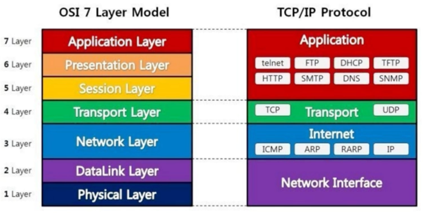

### IPC 를 위한 패턴
일반적인 IPC 는 크게 2가지로 나늬어요
- Sync (동기) 방식
  - (Restful 방식) HTTP, gRPC 방식을 많이 활용해요
  - 적절한 경우
    - 굉장히 중요한 작업을 하는 경우
    - 비교적 빠른 작업에 대한 요청일 경우
    - 선행작업이 필수적인 비즈니스인 경우
  - 부적절한 경우
    - 매우 복잡하고 리소스 소모가 많은 작업의 요청일 경우
    - 비교적 한정된 컴퓨팅 리소스를 가지고 있는 경우
- Async (비동기) 방식
  - Queue 를 활용하여 Produce, Consume 방식으로 데이터 통신을 해요
    - e.g. rabbitmq, kafka pubsub...
  - 적절한 경우
    - 매우 복잡하고 리소스 소모가 많은 작업의 요청일 경우
    - 비교적 한정된 컴퓨팅 리소스를 가지고 있는 경우
      - 그런데, 서버 리소스로 인해 누락이 되면 안되는 경우
    - 독립적으로 실행되는 수 많은 서비스들이 있는 대용량 MSA 환경
      - 응답 대기시간을 최소화
      - 느슨하게 결합도를 낮춰, 개별 서비스의 확장성을 유연하게 처리
      - 각 서비스에 문제가 생겼더라도, 복구 시에는 데이터 안정적으로 처리 가능

#### 일반적인 Sync IPC 패턴 1 - HTTP
OSI 7응용 계층의 통신 프로토콜로서, L4 계층에서는 tcp 방식을 활용하는 프로토콜
여러가지 종류의 메서드가 존재하지만 일반적으로 4개의 메서드를 활용해요 (CRUD)
- **GET**
  - 리소스를 얻어오기 위한 메서드 (Read)
- **POST**
  - 리로스를 변경(생성) 하기 위한 메서드 (Create)
- **PUT**
  - 리소스를 변경 (생성된 리소스를 변경) 하기 위한 메서드 (Update)
  - **멱등성(Idempotence) 필수**
- **DELETE**
  - 리소스를 삭제하기 위한 메서드 (Delete)

#### 일반적인 Sync IPC 패턴 2 - gRPC
**GRPC (google Remote Procedure Call)**
- Protocol Buffer라는 것을 기반으로 한는 원격 프로시저 호출 프레임워크에요.
- 일반적으로 Server to Server Call 경우에 한해서 사용해요.
- 정확히 특정 계층의 프로토콜이라고 하기는 어려워요. (L4~L7)
- 빠르지만, 번거로운 작업들과 위험이 수반되어요. 
- Proto를 미리 정해놓고 통신을 해요

### Async 방식
Queue 를 활용하여 Produce, Consume 방식으로 데이터 통신을 해요  
큐를 활용하는 방식을 표준화한 프로토콜도 존쟇해요

MQTT, AMQP: OASIS(Organization for the Advancement of Structured Information Standards)
라는 곳에서 표준으로 제정한 표준 프로토콜

**MQTT(Message Queuing Telemetry Transport)**
- 경량 메세징 프로토콜로서, IoT 등 경량화가 최대 목적인 프로토콜
- Publish, Subscribe, Topic 모델 사용
**AMQP(Advanced Message Queuing Protocol)**
- 엔터프라이즈 레벨의 메세징 시스템을 위한 프로토콜
- MQTT 개념 외에도, Exchange, Binding 등 개념 추가
- Rabbit MQ, Active MQ, ...

일반적으로 MQTT 를 사용하지 않고 AMQP 를 사용한다
Spec 도 낮고 기능도 별로 없음

#### AMQP(Advanced Message Queuing Protocol)
발행자는 Exchange 만 바라봐요
- Exchange 는 Routing 역할
Queue-Consumer
- --> Subscribe
- --> Request to Message Sending

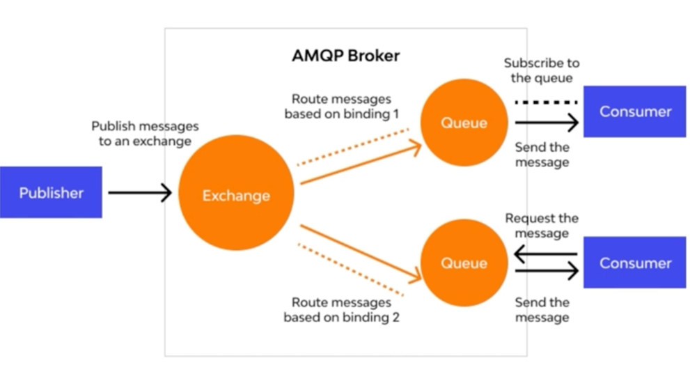

#### MQTT, AMQP 도 아닌 kafka...?
- Kafka는 링크드인에서 개발한 대용량의 데이터 스트림을 처리하기 위한 분산 스트리밍 플랫폼
- MQTT, AMQP 등의 표준을 구현하는 프로토콜이 아닌, 독립적인 데이터 스트리밍 플랫폼
- 비교적 복잡한 개념들을 가지고 있지만, 성능(메세지 처리량)은 압도적이에요.
- 고성능, 고용량 메시지 처리를 위해 설계되었어요
- 많은 회사에서, 그리고 JVM과의 좋은 궁합으로 상당히 폭넓게 사용되어 지고 있어요
- 다만, 제대로 사용을 하기 위한 러닝 커브는 꽤 높은 편이에요

#### kafka 의 구성 요소
- Topic: Producer, Consumer 의 메시징 객체
- Partition: Topic 을 물리적으로 분할하고, 처리
- Broker: Kafaka 클러스터의 각 노드를 의미
- Zookeeper: Kafaka 클러스터의 메타데이터 관리

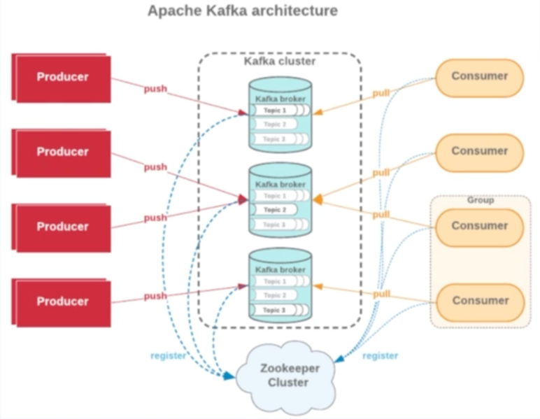

#### Async 통신의 가장 큰 단점
- 1 Request -><- Sync 방식 -><- 1 Response
- 1 Produce -><- Asynce 방식 -><- 1 Consume??
  - 1개의 큐를 가지고 하나의 Produce 에서 하나의 Consume 으로 보내는 것은 불가능하다
  - Consume을 하다가 Handling을 하다가 Consume 서버가 죽어버리면 그서버가 Commit을 했는지 유무를 알수가 없다 그래서 불가능
  - 1개의 Produce로 1번의 Consume을 하는것은 그래서 불가능하다
  - 그래서 다시 Consumer 서버가 다시 정상으로 켜졌을 때 큐잉 시스템이 아까 너 Commit 안보내서 한번더 똑같은 데이터를 2번이상 받을 수 있다

### 멱등성이 중요한 이유
#### Async 통신의 한계
특정 상황들에서는 필연적으로 두 번 이상 데이터를 받을 가능성 존재
- Async 통신의 장점이 명확하고, 사용하기에 매우 적절한 경우들이 존재하나 한계 존재 (e.g. Logging Pipeline, UX 상 빠른 리턴 후 결과는 나중에 보여줘도 되는 케이스)

##### Logging Pipeline
Log Write to File -> File Scraping -> Pipeline .... -> Indexing .... -> Kibana(Elastic Search)

##### XX 페이 내 대출 가능 여부 조회 플랫폼
- 인증
- 각 기관들에서 대출 가능 여부를 확인하고 있는 중이에요. 완료되면 알림톡을 보내드릴게요~
- 완료 이벤트를 수신하여 XX톡 발송 // 이후 중요한 정보를 관리하는 외부 기관 프로세싱 수행 등

#### 그렇다면, Async 통신을 활용해서 중요한 비즈니스를 하기는 어렵겠네요?
상황:
- 2번 이상 수신되는 것이 문제
- 중요한 비즈니스에서도 리소스 활용을 최적화 하고 싶어요. (서버를 활용하는 입장에서 wait 하는 일에대해서 다른일을 시킴)

2번 이상 수신되어도, 괜찮을 수 있는 방법이 없을까?
-> 멱등성 (Idempotent)이 필요한 상황 식별

##### 멱등성이 무엇인가요?
- 간단히 말해서 특정 호출이 1번 혹은 여러번 호출되어도 서버의 상태는 1번 호출된 것과 동일해야 한다.

일반적으로 Update, Delete, Put 요청은 멱등성을 가지며, Create 요청은 멱등성을 가지지 않아요. <br>
-> **Sync 통신에서는 멱등성을 Business Logic 으로 구현해요**

#### Asyn는 통신에서의 멱등성
Async 통신에서는 기본적으로 멱등성이 보장되지 않는 통신 방식이에요<br>
그럼에도 멱등성을 구현하기 위해서는, "다른 무언가"가 필요해요! -> 다른 큐잉 솔류션(Ex-Once)

"멱등성" 구현을 위한 DB Table(RDB)를 사용해서 멱등성을 구현할 수 있어요!

**queue_log**
- message_id: 특정 큐잉 메시지의 고유 식별자
- status: 메시지의 상태 (대기중, 처리중, 완료)
- created_timestamp: Producer 로부터 메시지가 큐에 추가된 시간
- processed_timestamp: Consumer 로부터 메시지가 큐에 처리된 시간
- processed_status: Consumer 로부터 처리된 메시지의 결과 (성공, 실패)

#### 멱등성이 구현된 Producer, Consumer
##### 멱등성 구현 이전,
Producer 는 항상 메시지를 생성하여 큐에 추가하고, Consumer 는 항상 메시지를 처리해요
##### 멱등성 구현 이후,
###### Message Produce 시,
- Produce 전에, queue_log 테이블에 동일한 message_id 가 존재하는지 확인
  - 존재할 경우, 이미 수행되었으므로 에러/스킵 처리
  - 존재하지 않을 경우, 새로운 메시지를 큐에 추가
###### Message Consume 시,
- Consume 전에, queue_log 테이블에서 message_id 의 상태를 확인
  - 처리된 경우 혹은 처리중인 status 인 경우, 중복 처리로 간주하여 에러/스킵 처리
  - 처리되지 않은 경우, message_id 의 status 값을 처리중으로 변경 후에 메시지 처리
    - 성공 시, processed_status 값을 성공으로 처리
    - 실패 시, processed_status 값을 처리 실패로 처리

#### 멱등성이 구현된 메시징 솔루션
멱등성이 워낙 중요하므로, 여러 메시징 오픈소스에서도 기능을 내장하는 경우가 있어요.
(e.g. Exactly Once)

하지만, 앞에서 배우셨다시피 기본적으로 메시징(큐잉)은 멱등성을 보장하지 않아요.<br>
즉, 위 기능을 제공한다는 얘기는 앞에서 저희가 살펴보았던 멱등성 보장 프로세스를 내장하고 있다는 뜻이에요.<br>
당연히 사용하지 않는 것에 비해서는 퍼포먼스(성능)적인 차이가 존재하게 되어요.

**단순히, Exactly Once 를 지원하네요.가 아니라 내부적으로는 이런식으로 동작하겠네 가 중요해요!!**

#### 결론
IPC -> Inter Process Communication -> 다수의 Process
- 일반적으로 Process=Service-> IPC 는 서비스 간의 통신
- IPC 방식에는 크게 Sync, Async 방식이 존재해요.
Sync: Http, grpc
- Async: 메시지 큐잉
Async 통신의 한계. 그러나 가지는 장점이 한계를 뛰어넘기 때문에, 이를 극복하기 위한 **멱등성** 식별<br>
최근의 메시징 시스템은 멱등성 기능을 내재하는 Exactly Once 기능을 제공하기도 해요.

**현상을 그대로 받아들이는 것이 아니라, 왜 이런 기능들이 나오게 되었을까를 생각해 보아요!**

# Kafka는 무엇일까?
## kafka 의 기본개념
### Why Kafka? 1
kafka 는 일반적인 큐잉을 위한 오픈소스? like RabbitMQ (AMQP)?<br>
kafka 는 실시간 이벤트 스트리밍 플랫폼!
- LinkedIn에서 겪었던 다양한 어려움 (확장 용이성, 고성능 실시간 데이터 처리)
  - e.g. 채팅, 피드 등에서 필요한 "실시간성" 처리 문제
- 고가용성, 고성능
  - 기존의 SYnc 방식을 대체 "가능"할 수도 있는 수단
- 일반적으로 규모가 작은 비즈니스에는 비적합
  - 일단 큐에 넣어두고, 필요에 따라 나중에 처리해도 되는 비즈닛느
  - 라우팅 변경에 대한 가능성이 굉장히 큰 비즈니스
    - 오히려 간단한 구조의 RabbitMQ가 적합할 수도.

### Why Kafka? 2
대규모의 실시간 이벤트/데이터 스트리밍이 필요한 비즈니스에 적합
-> 트위터, 카카오, 넷플릭스, 우버...

대규모를 지원한다는 것 -> 소규모도 당연히 지원 -> 그렇다면 모두 다 Kafka 쓰면 되는 것 아닌가요?
- **YES!**

그러나, 적합하지 않을 수 있다라는 의미 -> Over Spec.
- -> High Engineering Learning Curbe, Kafka 전문 관리 인력 필요.

### kafka의 기본 개념 1(Producer, Consumer, Consumer Group)
#### Producer
- 메시지를 발행 하는 **"주체"**
- Produce: 메시지를 발행하는 동작
#### Consumer
- 메시지를 소비(즉, 가져와서 처리) 하는 **"주체"**
- Consume: 메시지를 가져와서 처리하는 동작
#### Consumer Group
- 메시지를 소비(즉, 가져와서 처리)하는 **"주체 집단"**

### kafka의 기본 개념 2(Kafka Cluster, Topic)
#### Producer
- Kafka Cluster 에 존재하는 Topic 에 메시지를 발행하는 **"주체"**
- Produce: 메시지를 Kafka Cluster 에 존재하는 Topic 에 발행하는 동작

#### Consumer
- Kafka Cluster 에 존재하는 Topic 에서 메시지를 소비(즉, 가져와서 처리)하는 **"주체"**
- Consume: 메시지를 Kafka Cluster 에 존재하는 Topic 으로부터 가져와서 이를 처리하는 동작

### kafka의 기본 개념 3(Kafka Broker)
#### Producer
- **Kafka Cluster** 내 **Topic** 이 포함된 Kafka Broker 에 메시지를 발행 하는 **"주체"**
- Produce: 메시지를 Kafka Broker 내 Topic 에 발행하는 동작

#### Consumer
- **Kafka Cluster** 내 Topic 이 포함된 Kafka Broker 로부터 메시지를 소비(즉, 가져와서 처리) 하는 **주체**
- Consume: 메시지를 Kafka Broker 내 Topic 으로부터 가져와서 이를 처리하는 동작

### kafka의 기본 개념 4(Zookeeper)
#### Apache Zookeeper (for hadoop Ecosystem)
- 분산 처리 시스템에서 분산 처리를 위한 코디네이터
- -> **누가 리더인지, 어느상황인지, 동기화 상태 등 관리**
e.g. 타조, 피그, 코끼리...
#### Kafka Cluster 를 관리.
- Kafka Broker 의 상태를 관리하고
- Cluster 내에 포함된 Topic 들을 관리하며
- 등록된 Consumer 정보를 관리하는 "주체"

## Kafka Topic 설계 시 유의 사항
### Kafka Topic ?
- 메시지를 발행하고 소비할 수 있는 "객체" (Object)
- "~ 토픽에 Produce 된 메시지를 Consume 하여 처리한다."

- Kafka Topic 은 고가용성, 고성능을 구현하는 핵심 개념

Kafka Topic 에 존재하는 수많은 설정 값들... -> 성능 가용성에 엄청난 차이를 불러 일으킬 수 있어요<br>
**즉, 비즈니스에 따라 Topic 의 설정은 완전히 달라질 수 있어요**<br>
**Kafka Topic 내 설정들이 어떤 것을 의미하는 지 "이해"할 수 있다면! 적절한 Topic 설정이 어떤 것인지, "판단" 할 수 있을거에요**

### Kafka Topic 개념1 (파티션, Partition)
- 메시지를 발행/소비 하는 객체로서, 수 많은 설정 값들이 존재해요.
- 먼저 Topic 설정을 이해하기 위해서는 Topic 을 이루는 Partition 에 대해 이해가 필요해요.

- Topic 은 1개 이상의 Partition 으로 이루어져요.
  - Partition 이란, 하나의 토픽에 포함된 메시지들을 물리적으로 분리하여 저장하는 저장소에요.
    - 하나의 메시지를 분리시켜 저장하는 것이 아닌, 하나의 메시지가 하나의 파티션에 들어가는 형태에요
      - Not Sharding, Partitioning!
      - 많이 분리 -> 많은 물리적 리소스 활용 가능
      - Partition 이 많으면, 성능이 향상 되어요.

**파티션 -> 성능과 직결되는 요소**

### Kafka Topic 개념 2(파티션 갯수와 성능)
- 하나의 Partition 은 하나의 Kafka Broker 에 소속되어요 (1:1)
- 하나의 Kafka Broker 는 1개 이상의 Partition 을 가지고 있어요. (1:N)
- Partition 갯수가 많다고 해서, Kafka Broker 갯수가 많은 것을 의미하지는 않아요.
  - 즉, Partition 갯수가 절대적인 성능의 결정 요소는 아니에요.

**하나의 물리적인 Broker 퍼포먼스에는 한계가 있으니까요.**

### Kafka Topic 개념 3(Partition 과 Partition Replica)
- 파티션의 Replication Factor 는, 가용성을 위한 개념이에요.
- 하나의 파티션은, Kafka Cluster 내에 1개 이상의 복제본(Replica)을 가질 수 있어요.
  - RF(Replication Factor) 는 이 복제본의 갯수를 의미해요.
- 즉, RF 가 1보다 큰 수치를 가져야만 고가용성을 달성할 수 있어요.
  - 일반적으로 클 수록, 가용성이 높다고 할 수 있어요.
  - 물론, Broker 갯수가 충분할 때 한정이에요.
- 너무 크면 메시지의 저장 공간을 낭비할 수 있어요.
- 그리고 Produce 할 때에도, 지연 시간이 길어질 수 있어요.

### Kafka Topic 개념 4(ISR, In-sync Replica) "Sync" 가 되었다고 판단 가능한 레플리카 그룹
"복제가 되었다"
- Partition 의 복제 본이 많아지면 (RF가 커지면) 사용성이 늘어나요
  - 그리고 'Produce' 시에도 복제해야할 데이터가 늘어나요
- -> Produce 시의 지연시간이 길어질 수 있어요.
  - 하지만, 그럼에도 지연 시간은 짧게 유지하고 싶다면?
- ISR(In-sync Replica) 그룹 이란, 하나의 파티션에 대한 Replica 들이 동기화 된 그룹을 의미.
  - -> ISR 그룹에 많은 파티션 포함
    - -> Produce 신뢰성/가용성 향상, 지연시간 증가
  - -> ISR 그룹에 적은 파티션 포함
    - -> Produce 신뢰성/가용성 하락, 지연시간 감소
- 적절하게 토픽에 Produce 되었다
  - -> 토픽 내 파티션의 모든 ISR 그룹에 복제 되었다.

### Kafka Topic 설계 시 유의할 것들
- 토픽에 포함된 파티션 갯수 (Partition Number) - Topic 을 사용하기 위한 일꾼들
  - 일반적으로 퍼포먼스와 연관
- 토픽에 포함된 파티션의 복제본 갯수 (RF, Replication Factor) - Produce 시, 정상적으로 N개 "Replication" 가 되었다.
  - 일반적으로 가용성과 연관
- 토픽의 ISR 그룹에 포함된 파티션 그룹 (ISR, In-sync Replica) - Replica 들이 정삭적으로 "Sync" 가 되었다. (복제)
  - 일반적으로 Produce 시의 지연 시간, 신뢰성과 연관

이 모든것에 대한 전제는 충분한 Kafka Broker 의 개수이다.

### 결론
Kafka 는 대규모 이벤트/데이터 스트리밍 **플랫폼**
대규모 분산 처리 환경에서 적합한 선택지.

But, 높은 러닝 커브와 카프카 클러스터 운영을 위한 전문 인력들의 필요성<br>
그럼에도,잘 사용한다면 신뢰성/가용성/성능 면에서는 최고의 효율<br>
잘 사용하기 위해서는 "토픽"을 이루는 파티션과 관련된 설정들의 "이해" 필요
비즈니스의 특성에 따라, 인프라 환경에 따라서 적절한 설정값들을 "판단" 필요

### Kafka 를 구축해 보기에 앞서.. Zookeeper 는 왜?
Zookeeper 는 Apache 재단에서 초기 Hadoop 의 하위 프로젝트로 개발되었던, 분산 시스템 코디네이터 기능 확장에 따라서, 분산 시스템에서 공통적으로 겪는 문제를 해결하는 코디네이터로서 프로젝트 분리

### Kafka Cluster 또한 분산 시스템으로서 Zookeeper 필요
- Cluster 내에서 어떤 Broker 가 Leader Broker 인지 (**Controller 선정**)
  - 어느 Broker 가 Partition/Replica 리더를 선출 할 지 선정
- Topic 의 파티션 중에 어느 것이 Leader Partition 인지 정보 저장
  - 장애 시, 어느 파티션이 우선되는 지 정보 관리
- Cluster 내 Broker 들의 메시징 Skew(데이터 분산되어 있는 정도) 관리 / Broker 내 Partition 들의 Skew 관리등의 코디네이터 역할 수행


### 실습 계획
My Kafka Cluster
- 1 Broker
- 1 Zookeeper
- 1 Kafka-ui (Kafka Cluster 의 상태를 확인할 수 있는 UI Tool)
#### using Docker-Compose
- Sample Producer
- Sample Consumer
#### Simple Logging Pipeline
- Kafka 를 사용하여, Async 방식으로 로그를 발행하고, Consumer 에서 stdout 을 통해서 출력하는 Pipeline
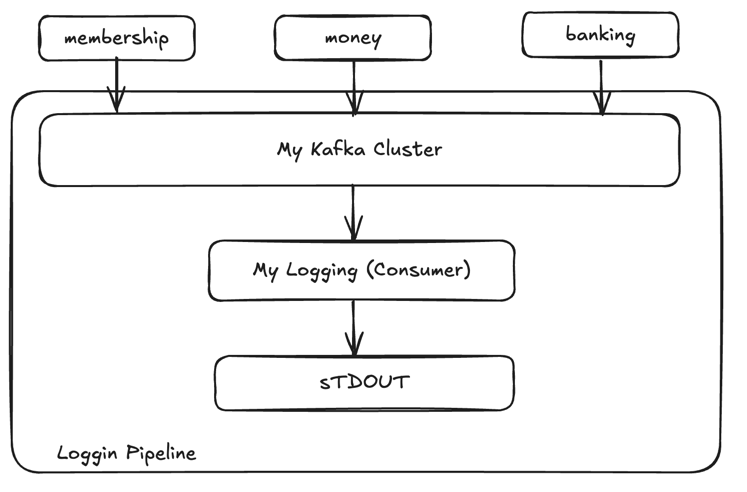

### Logging Pipeline 을 위한 Topic 설계, 생성
- my.logging.out.stdout
  - partition 1개
  - replication-factor = 2
  - min.insync.replica = 1
```yaml
kafka-topic.sh --create
 --zookeeper <zookeeper:2181>
 --topic<my.logging.out.stdout>

 --partitions 1
 -- replication-factor 2
 -- config min.insync.replicas=1
```

카프카 서버에 들어가보면 아래 path에 kafka-topics.sh 파일이 존재 함<br>
`/opt/bitnami/kafka/bin`
- 본래대로라면 위에 있는 파일을 실행시켜서 환경 변수를 설정해서 topic을 생성하지만, kakfka-ui에서 토픽을 생성하는 툴을 제공하기 때문에
- 카프카-ui 에서 함

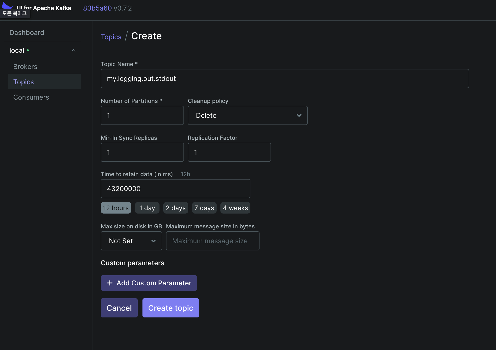


### 고도화된 Logging Pipeline ?
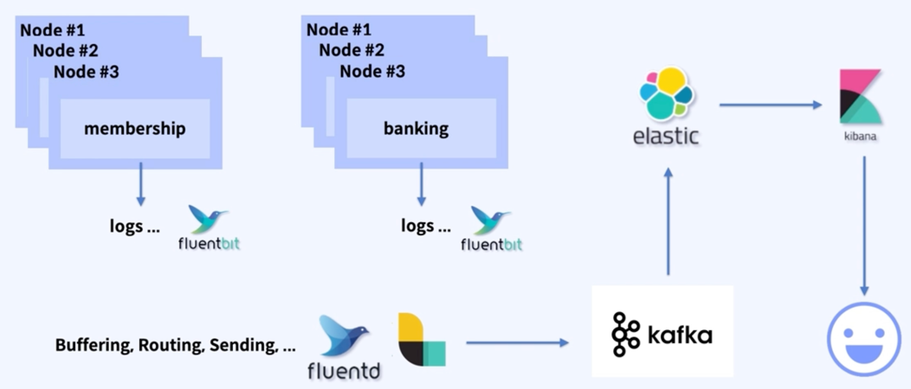

### 마이 페이에서 IPC 가 필요한 구간 식별 (for banking-service)
#### banking-service
#### - registerBankAccount API
- ...
- -> call membership-service (**findMembershipByMemberId**)
    - 특정 고객의 고객 상태가 정상적인지 체크하기 위함
#### - requestFirmbanking API
- ...
- -> call External Bank   -> (http)
    - 실제 외부 은행에 입/출금 요청을 하기 위함

### 마이 페이에서 사용 가능한 Option과 적용할 패턴 결정1
#### IPC Pattern 을 선택함에 있어 가능한 Options
- **Sync**
    - http: 통신 방식이 유동적일 경우. 리소스에 크게 구애받지 않아도 되는 경우
    - grpc: 통신 방식이 강하게 정해진 경우. 리소스 제한이 큰 경우
- **Async**
    - 고성능 이벤트/데이터 플랫폼의 존재 유무                          -----> 가장 일반적인 결론 ---> Sync 방식의 Http Call 사용
    - 비즈니스적으로 판단 필요
        - 민감한 비즈니스인지
        - 조금 응답 지연이 늦어도 괜찮은지
        - 몰리는 상황(불안정한 인프라)에서 어떻게든 수행해 줄만한 가치가 있는지
        - 비동기 통신을 안정적으로 처리할만한 인프라가 있는지

### 실습 계획 (for banking-service)
1. docker-compose 를 통해서 membership-service 의 endpoint 를 환경 변수(env)로 등록
2. http call 을 위한 기본 어댑터 구현, Port 인터페이스와 연동
3. dummy Bank Server 구현
4. API 를 통한 IPC 적용 테스트

### kafka 를 활용한 마이페이 "충전" 서비스 고도화
#### 충전 서비스의 목적과 비즈니스 고찰 해보기
##### Async 패턴을 적용하는 결정의 기준에 있어서 하나의 큰 기준은...
일단 들어온 요청에 대해서,, 무조건 해줘야 회사가 단기적, 장기적 이득 ??
e.g. 회원 가입 하는 단계에서의 통신사 본인 인증, 1원 인증

그렇다면 "충전" 서비스의 "충전" 이라는 비즈니스는??
- 마이 머니는 마이 페이의 핵심 서비스 
- 총전이란, 이 마이 머니를 충전해 달라는 고객의 의사 요청 받는 비즈니스
  - **"어떻게든 수행해야하는 동작" -> 인프라 여건 확인 -> "Async"방식과 큐잉 사용 적절**
    - **비즈니스적으로 비싼 요청인가?**

### 충전 서비스 고도화 설계 (as-is)
마이 머니 충전해주세요!!
.png)
.png)

